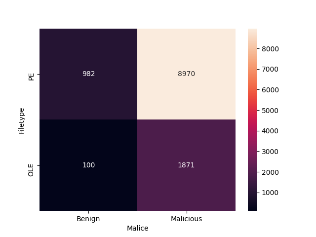
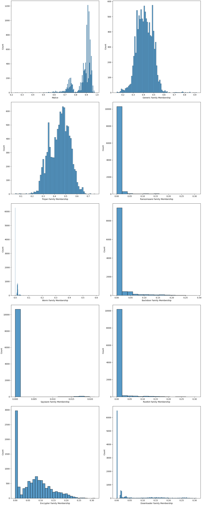

# DikeDataset 🗃️

## Table of Content 🔖

- [DikeDataset 🗃️](#dikedataset-️)
  - [Table of Content 🔖](#table-of-content-)
  - [Description 🖌️](#description-️)
  - [Labels Exploration 🔍](#labels-exploration-)
  - [Methodology 👷](#methodology-)
    - [Downloading Step](#downloading-step)
    - [Renaming Step](#renaming-step)
    - [Scanning Step](#scanning-step)
    - [Labeling Step](#labeling-step)
  - [Sources ©️](#sources-️)
  - [Folders Structure 📂](#folders-structure-)
  - [Citations 📄](#citations-)

## Description 🖌️

**DikeDataset** is a **labeled dataset** containing **benign and malicious PE and OLE files**.

Considering the number, the types, and the meanings of the labels, DikeDataset can be used for training artificial intelligence algorithms to predict, for a PE or OLE file, the **malice** and the **membership to a malware family**. The artificial intelligence approaches can vary from machine learning (with algorithms such as regressors and soft multi-label classifiers) to deep learning, depending on the requirements.

It is worth mentioning that the numeric labels, with values between `0` and `1`, can be transformed into discrete ones to respect the constraints of standard classification. For example, if a superior malice limit for benign files is set to `0.4`, a file having the malice of `0.593` is considered malicious.

## Labels Exploration 🔍

<details>
    <summary>Samples Distribution</summary>
    
</details>

<details>
    <summary>Labels Identification</summary>

| Name       | Type    |
| ---------- | ------- |
| type       | int64   |
| hash       | object  |
| malice     | float64 |
| generic    | float64 |
| trojan     | float64 |
| ransomware | float64 |
| worm       | float64 |
| backdoor   | float64 |
| spyware    | float64 |
| rootkit    | float64 |
| encrypter  | float64 |
| downloader | float64 |

</details>

<details>
    <summary>Mean, Standard Deviation, Minimum and Maximum</summary>

|      | malice    | generic   | trojan    | ransomware | worm      | backdoor  | spyware    | rootkit    | encrypter | downloader |
| ---- | --------- | --------- | --------- | ---------- | --------- | --------- | ---------- | ---------- | --------- | ---------- |
| mean | 0.876484  | 0.412354  | 0.44581   | 0.00503229 | 0.0086457 | 0.0117696 | 0.00030322 | 0.00614807 | 0.0719921 | 0.037945   |
| std  | 0.0779914 | 0.0779332 | 0.0891624 | 0.0192288  | 0.0189522 | 0.0333144 | 0.00227205 | 0.0263416  | 0.0622346 | 0.0699552  |
| min  | 0.235294  | 0.140351  | 0.05      | 0          | 0         | 0         | 0          | 0          | 0         | 0          |
| max  | 0.981132  | 0.916667  | 0.76087   | 0.307692   | 0.59      | 0.290323  | 0.0212766  | 0.307692   | 0.3125    | 0.307692   |

</details>

<details>
    <summary>Histograms</summary>
    
</details>

## Methodology 👷

> **Observation**: A Bash [script](others/scripts/get_files.sh) can be used to replicate the downloading and the renaming steps. On the other hand, the last two steps consist of using functionalities that are available only in the `dike`, namely in [this](https://github.com/iosifache/dike/blob/main/codebase/scripts/continuous_vt_scan.py) Python script.

### Downloading Step

1. For PE files, a dataset (see the [Sources](#sources-️) section) created for a paper was downloaded. As the files were packed inside multiple folders (one for each malware family considered in the study), they were moved into two new folders, malice oriented.
2. For malicious OLE files, 12 daily (one from each 15th of the 12 previous months) archives were downloaded from MalwareBazaar (see the [Sources](#sources-️) section). After unarchiving, the files were filtered by certain extensions (`.doc`, `.docx` `.docm` `.xls` `.xlsx` `.xlsm` `.ppt` `.pptx` `.pptm`).
3. For benign OLE files, 100 files were manually downloaded from the results of random DuckDuckGo searches.

### Renaming Step

1. All resulting files were renamed by their SHA256 hash.
2. The OLE files, having the Office-specific extensions mentioned in the last paragraph, were replaced with `.ole`.

### Scanning Step

1. The hashes of all malicious files were dumped into a file.
2. The file containing hashes was uploaded into a bucket in Google Cloud Storage.
3. A Google Cloud Function was created, containing a Python script (*see the observation above*) and triggered by a Google Cloud Scheduler four times in a minute (to respect the API quota). It consumed the hashes by scanning them with the VirusTotal API and dumping specific parts of the results (antivirus engines votes and tags) into a [file](others/vt_data.csv).

### Labeling Step

1. The file containing the VirusTotal data, which resulted from the scanning step, was moved locally, where `dike` was already set.
2. To compute the malice, the weighted formula below was used, where the `MALIGN_BENIGN_RATIO` constant was set to `2`. This means that one antivirus engine considering that the file was malicious has the same weight (on a scale) as two engines considering it is benign.

```
malign_weight = MALIGN_BENIGN_RATIO * malign_votes
benign_weight = benign_votes
malice = malign_weight / (malign_weight + benign_weight)
```

3. To compute the membership on each malware family, a transformer was developed (*see the observation above*) to "*vote*" for each available family. For example, if an antivirus engine tag was `Trj`, then one vote for the trojan family was offered. All tags were consumed in this way and the votes for all families were normalized.
4. For the benign files, the process was straight-forward as the malice and the memberships were set to `0`.

## Sources ©️

1. [Malware Detection PE-Based Analysis Using Deep Learning Algorithm Dataset](https://figshare.com/articles/dataset/Malware_Detection_PE-Based_Analysis_Using_Deep_Learning_Algorithm_Dataset/6635642), containing malicious and benign PE files and having CC BY 4.0 license
2. [MalwareBazaar](https://bazaar.abuse.ch), containing (among others) malicious OLE files and having CC0 license
3. [DuckDuckGo](https://duckduckgo.com/), that was used for searching benign documents with patterns such as `filetype:doc`

## Folders Structure 📂

```
DikeDataset                                 root folder
├── files                                   folder with all samples
│   ├── benign                              folder for benign samples
│   │   └── ...
│   └── malware                             folder for malicious samples
│       └── ...
├── labels                                  folder with all labels 
│   ├── benign.csv                          labels folder for benign samples
│   └── malware.csv                         labels folder for malicious samples
├── others                                  folder with miscellaneous files
│   ├── images                              folder with generated images
│   │   ├── distribution.png                image with a plot with the distribution of samples
│   │   └── histograms.png                  image containing the histograms for each numeric label
│   ├── scripts                             folder with used scripts
│   |   ├── explore.py                      Python 3 script for labels exploration
│   |   ├── get_files.sh                    Shell script for downloading a large part of the samples
│   |   └── requirements.txt                Python 3 dependencies for the explore.py script
│   ├── tables                              folder with generated tables
│   │   ├── labels.md                       table in Markdown format containing the identification 
│   │   │                                   of labels
│   │   └── univariate_analysis.md          table in Markdown format containing the results of a
│   │                                       univariate analysis
│   └── vt_data.csv                         raw VirusTotal scan results
└── README.md                               this file
```

## Citations 📄

DikeDataset was proudly used in:

- **Academic studies** with BibTeX references in [`others/citations.bib`](others/citations.bib)
    - "*A Corpus of Encoded Malware Byte Information as Images for Efficient Classification*"
    - "*Adversarial Robustness of Learning-based Static Malware Classifiers*"
    - "*An ensemble deep learning classifier stacked with fuzzy ARTMAP for malware detection*"
    - "*AutoEncoder 기반 역난독화 사전학습 및 전이학습을 통한 악성코드 탐지 방법론*"
    - "*Comparison of Feature Extraction and Classification Techniques of PE Malware*"
    - "*Deep Learning based Residual Attention Network for Malware Detection in CyberSecurity*"
    - "*Detecting Malware Activities with MalpMiner: A Dynamic Analysis Approach*"
    - "*Effective Call Graph Fingerprinting for the Analysis and Classification of Windows Malware*"
    - "*Evaluation and survey of state of the art malware detection and classification techniques: Analysis and recommendation*"
    - "*Intelligent Endpoint-based Ransomware Detection Framework*"
    - "*Knowledge Graph creation on Windows malwares and completion using knowledge graph embedding*"
    - "*Machine Learning for malware characterization and identification*"
    - "*Malware Detection by Control-Flow Graph Level Representation Learning With Graph Isomorphism Network*"
    - "*Malware Detection in URL Using Machine Learning Approach*"
    - "*SoK: Use of Cryptography in Malware Obfuscation*"
    - "*Técnicas de aprendizaje máquina para análisis de malware*"
    - "*Toward a methodology for malware analysis and characterization for Machine Learning application*"
    - "*Toward identifying APT malware through API system calls*"
    - "*Uso de algoritmos de machine learning para la detección de archivos malware*"
- **Projects**
    - [`dike`](https://github.com/iosifache/dike), a platform that uses artificial intelligence techniques in the process of malware analysis
    - [Various open source projects](https://github.com/search?q=dikedataset&type=code).
 
> **Notice**: If you're using DikeDataset in an academic study or project, please open an issue or submit a PR if you want to be cited in the above list and the citations file.
